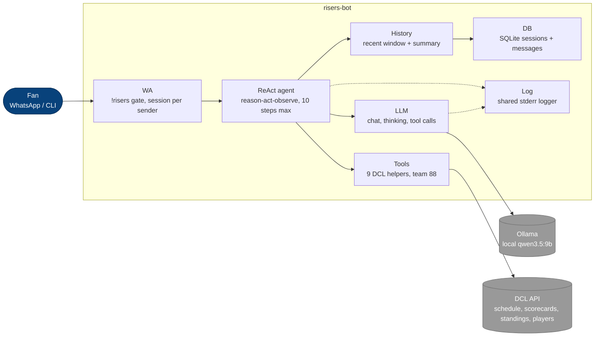

# Risers Bot

Your WhatsApp cricket pundit for **Risers (DCL team 88)** — local LLM grounded in real DCL data for accurate answers.

## Design



Dependency order: `db ← history ← agent ← cmd/wa`, `agent → tools → DCL API`.

## UserPrompt - try out!

CLI: `risers-bot "<question>"` — WhatsApp: `!risers <question>`

- `List all Risers games played in DCL Fall 2026`
- `Is there DCL Fall 2026 schedule uploaded?`
- `Summarize last game for me.`
- `Summarize the match against Daring team in DCL Fall 2026.`
- `Summarize match 5954: who played, toss, result, and top 3 batters. Keep it short.`
- `Who scored the most runs in the last Risers game?`
- `What is the team id for the Royals?`
- `List Rahul Amratlal Patel runs scored per game in DCL Fall 2026`
- `List Rahul Amratlal Patel runs scored per game in DCL Summer 2026. One line per game: runs off balls.`
- `Is there DCL Spring 2027 schedule uploaded?`

More in `scripts/regress.sh` — each run uses a fresh DB so tries never pollute each other.

## Features

- [x] Answer Risers questions on WhatsApp via `!risers`
- [x] Answer one-off questions from the command line
- [x] Keep a separate chat history per user in SQLite
- [x] Trim history to fit the model's context window
- [x] Summarize very old chats instead of dropping them
- [x] Chat via local Ollama model
- [x] Run a ReAct loop that calls tools then answers
- [x] Look up DCL data with tools:
  - `get_tournaments` — list all tournaments
  - `get_schedule` — fixtures and results for a team
  - `get_match_scorecard` — full scorecard with every batter and bowler
  - `get_points_table` — standings with wins, points, and net run rate
  - `search_players` — find a player id by name
  - `get_player_stats` — career batting and bowling per game
  - `get_player_stats_filtered` — one player's games and totals for one tournament
  - `summarize_match` — pundit summary from the Risers perspective
  - `find_opponent` — find a team id by partial name
- [ ] Auto-summarize old history on every turn

Base URL: `https://dallascricket.org:3000` (public `GET`, no auth).
Default team: Risers, `RISERS_TEAM_ID=88`.

## Repository structure

```
risers-bot/
├── AGENTS.md
├── README.md
├── go.mod
├── cmd/
│   └── risers-bot/main.go   # CLI entry (stub)
└── internal/
    ├── db/                  # SQLite persistence only
    ├── history/             # Context-window policy
    ├── llm/                 # Provider interface
    │   └── ollama/          # Ollama transport
    ├── agent/               # ReAct loop
    ├── tools/               # DCL API tools (new, planned)
    └── wa/                  # whatsmeow transport (empty)
```

Dependency order: `db ← history ← agent ← cmd/wa`, `agent → tools → DCL API`.
`db` never imports `llm`/`history`; `ollama` never imports `history`.

## Tech stack

- Go 1.26.4 (`go.mod`)
- SQLite via `github.com/mattn/go-sqlite3` (CGO)
- Ollama `qwen3.5:9b` (local LLM)
- whatsmeow (planned WhatsApp transport)
- DCL API `dallascricket.org:3000` (tool data source)

## Prerequisites

- Go 1.26+
- C toolchain (`clang`/`gcc`) — required for `go-sqlite3`
- Ollama at `http://localhost:11434` with `qwen3.5:9b` (LLM path only)

## Setup

Build:

```bash
cd risers-bot
go mod tidy
CGO_ENABLED=1 go build -o risers-bot ./cmd/risers-bot
```

Run — ask one question (single turn, session `cli`):

```bash
./risers-bot "who won the last Risers game?"
```

Run — WhatsApp listener (answers `!risers <question>`, one session per sender):

```bash
./risers-bot -wa
```

> First `-wa` run needs `RISERS_WA_PHONE` (digits only, e.g. `15551234567`) for pairing-code login.

Flags:

| Flag | Default | Description |
|---|---|---|
| `-wa` | off | Run as WhatsApp listener instead of one-shot CLI |
| `-log` | `$RISERS_LOG_LEVEL`, else `info` | Log level: `info` or `debug` |

Run checks:

```bash
go vet ./...
gofmt -l .
go test ./...
```

> Binaries live under `cmd/<name>/`. Run `go build ./...` from the repo root,
> not bare `go build`.

## Configuration

| Env var | Default | Description |
|---|---|---|
| `RISERS_DB` | `./risers.db` | SQLite database path |
| `RISERS_LOG_LEVEL` | `info` | Log level: `info` or `debug` (also `-log` flag) |
| `OLLAMA_MODEL` | `qwen3.5:9b` | Ollama model name |
| `RISERS_TEAM_ID` | `88` | DCL team ID (Risers). Other teams set their own ID |
| `DCL_BASE_URL` | `https://dallascricket.org:3000` | DCL API base URL |
| `RISERS_WA_STORE` | `./wastore.db` | WhatsApp device store path |
| `RISERS_WA_PHONE` | — | Phone number for first-run pairing-code login |

Runtime data (`*.db`, `/data/`) is git-ignored.

## Contributing

Contributions welcome — bug reports, new DCL tools, prompt tuning, docs.

- Open an issue first: https://github.com/Zero2Infinity/risers-bot/issues
- Keep PRs small: one file, one concern, reviewable diff (see `AGENTS.md`)
- Before pushing, run: `go vet ./...`, `gofmt -l .`, `go test ./...` (builds need `CGO_ENABLED=1`)

## References

- Ollama Chat API — https://docs.ollama.com/api/chat
- qwen3.5:9b — https://ollama.com/library/qwen3.5:9b
- DCL API base — https://dallascricket.org:3000/api/*

## Appendix — Acknowledgments

This bot stands on the shoulders of open source. Thank you to:

- [whatsmeow](https://github.com/tulir/whatsmeow) — the Go WhatsApp client that powers our transport: pairing-code login, event handling, and reply sending (signal-protocol encryption via `go.mau.fi/libsignal`, device store via `go.mau.fi/whatsmeow/store/sqlstore`).
- [go-sqlite3](https://github.com/mattn/go-sqlite3) — CGO SQLite driver behind per-session chat persistence.
- [Ollama](https://github.com/ollama/ollama) — local LLM runtime serving `qwen3.5:9b` for private, accurate answers.
- [Dallas Cricket League](https://dallascricket.org) — public API for schedules, scorecards, standings, and player stats.
